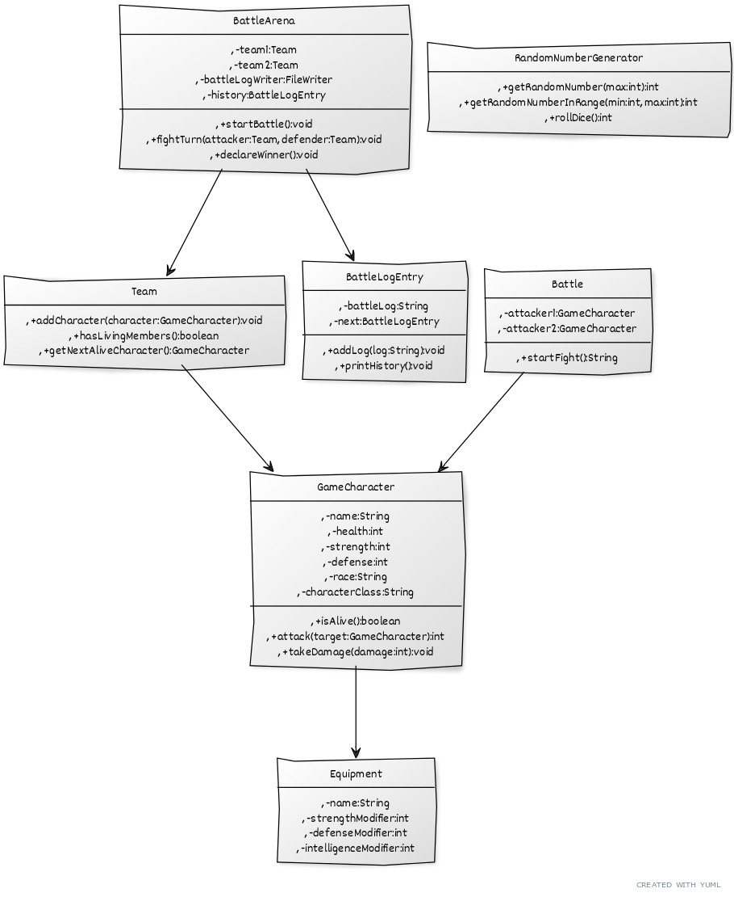

# RPG Combat Simulation

## 1. Problem Description

This program simulates a turn-based combat system between two teams of characters with different attributes (health, strength, defense) and abilities, designed to test and analyze combat interactions between teams. The goal is to create a realistic and engaging combat experience that incorporates randomness and strategic decision-making. The simulation allows users to create teams of heroes and villains, equip them with items, and watch them battle it out in an arena. By simulating battles using character stats and controlled randomness, the program helps developers prototype and balance gameplay mechanics without relying on a full graphical engine. Combat outcomes and logs are automatically recorded for post-battle analysis.

## 2. Program Structure

The program is structured into several classes, each responsible for a specific aspect of the simulation:

*   **GameCharacter**: Represents a character with attributes like name, health, strength, defense, race, and class. It also includes methods for attacking, taking damage, and checking if the character is alive.
*   **Team**: Represents a team of characters. It includes methods for adding characters, checking if the team has any living members, and getting the next alive character.
*   **Battle**: Simulates a fight between two characters. It includes methods for calculating damage and applying it to the target.
*   **BattleArena**: Manages the battle between two teams. It includes methods for starting the battle, simulating turns, declaring the winner, and logging the battle history.
*   **RandomNumberGenerator**: Provides random numbers for dice rolls and other events.
*   **BattleLogEntry**: Represents an entry in the battle log. It includes methods for adding log messages and printing the history.
*   **Equipment**: Represents an item of equipment that can be used by a character. It includes attributes for strength, defense, and intelligence modifiers.

*   **UML Diagram of above**:

## 3. Instructions to Run the Program

### To Compile and Run the Game Only (Skip Unit Tests)

1. Open a terminal and navigate into the `src/` folder.
2. Compile the game files into the `bin/` folder:
 javac -d ../bin Battle.java BattleArena.java BattleLogEntry.java Equipment.java GameCharacter.java RPGCombatMain.java RandomNumberGenerator.java Team.java
3. Navigate to the bin/ folder:
 cd ../bin
4. Run the game:
 java RPGCombatMain

### To Compile and Run Including Unit Tests (JUnit Required)

1. In the `src/` folder, compile all files including test classes using the JUnit JAR in the `lib/` folder
 javac -cp ".;../lib/junit-platform-console-standalone-1.10.2.jar" -d ../bin *.java
2. Run the game from the `bin/` folder:
 java -cp ../bin RPGCombatMain
3. Run all tests:
 java -jar ../lib/junit-platform-console-standalone-1.10.2.jar --class-path ../bin --scan-class-path

### Output and Save/Load
* The game will print the battle log to the console.

* It also saves the log to BattleLog.txt.

* To save the game state programmatically:
 arena.saveGameState("gamestate.txt");
* To load a previously saved game state:
 arena.loadGameState("gamestate.txt");

 
## 4. Task Allocation

*   *Mark (48427241)* – 25%: Led the development of core gameplay logic, including the GameCharacter and Battle classes. Also implemented most of the unit tests and assisted in debugging and integrating all modules.
*   *Nataly (48234842)* – 25%: Led the structural design of the project, implementing key classes like Team and BattleArena, producing the UML diagram, and writing the entire README.md and documentation. Major contributor to planning and team coordination.
*   *Wesly (47798289)* – 25%: Assisted with recursive structure (BattleLogEntry) and initial I/O feature implementation. Contributed to testing and logic review. 
*   *Nikhat (48815853)* – 25%: Contributed to code review, testing game behavior across edge cases, and refining documentation and save/load functionality.

## 5. Analysis of Two Methods

### 5.1. `GameCharacter.attack()`

This method simulates an attack by a character on another character.

*   **Time Complexity**: O(1) - The method performs a fixed number of operations (dice roll, damage calculation, health reduction), regardless of the input.
*   **Space Complexity**: O(1) - The method uses a constant amount of memory, regardless of the input.

### 5.2. `BattleArena.startBattle()`

This method manages the battle between two teams.

*   **Time Complexity**: O(n*m), where n is the number of members in team1 and m is the number of members in team2 - The method iterates through the teams until one is defeated.
*   **Space Complexity**: O(1) - The method uses a constant amount of memory, regardless of the input.
