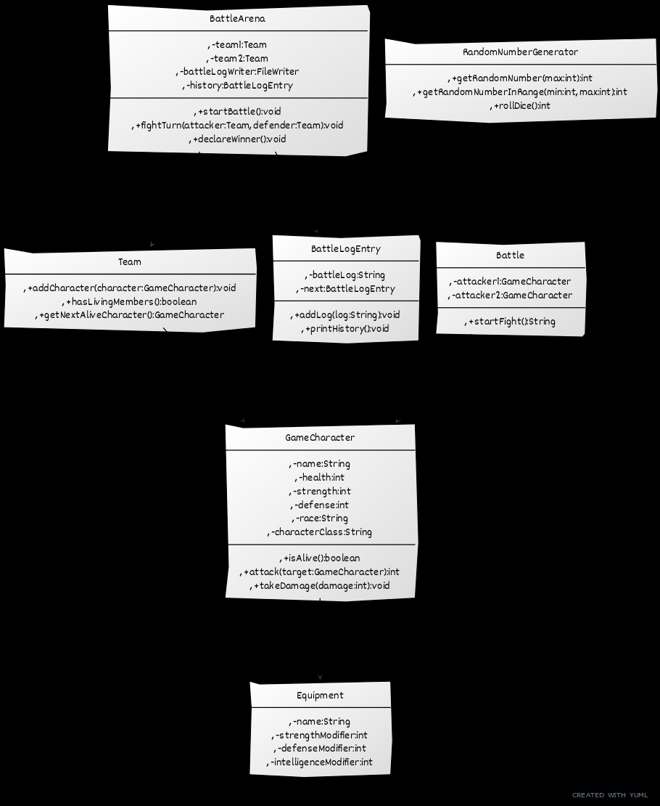

# RPG Combat Simulation

## 1. Problem Description

This program simulates a turn-based combat system between two teams of characters with different attributes (health, strength, defense) and abilities. The goal is to create a realistic and engaging combat experience that incorporates randomness and strategic decision-making. The simulation allows users to create teams of heroes and villains, equip them with items, and watch them battle it out in an arena. The outcome of each battle is logged to a file, providing a detailed record of the events.

## 2. Program Structure

The program is structured into several classes, each responsible for a specific aspect of the simulation:

*   **GameCharacter**: Represents a character with attributes like name, health, strength, defense, race, and class. It also includes methods for attacking, taking damage, and checking if the character is alive.
*   **Team**: Represents a team of characters. It includes methods for adding characters, checking if the team has any living members, and getting the next alive character.
*   **Battle**: Simulates a fight between two characters. It includes methods for calculating damage and applying it to the target.
*   **BattleArena**: Manages the battle between two teams. It includes methods for starting the battle, simulating turns, declaring the winner, and logging the battle history.
*   **RandomNumberGenerator**: Provides random numbers for dice rolls and other events.
*   **BattleLogEntry**: Represents an entry in the battle log. It includes methods for adding log messages and printing the history.
*   **Equipment**: Represents an item of equipment that can be used by a character. It includes attributes for strength, defense, and intelligence modifiers.

*   **UMLDiagram**

## 3. Instructions to Run the Program

1.  Compile the Java files using `javac *.java`.
2.  Run the program using `java RPGCombatMain`.
3.  The program will output the battle log to the console and save it to a file named `BattleLog.txt`.
4.  To save the game state, use the `saveGameState` method in the `BattleArena` class.
5.  To load the game state, use the `loadGameState` method in the `BattleArena` class.

## 4. Task Allocation

*   Mark: 50% (Designed the `GameCharacter` and `Battle` classes, implemented the combat logic, wrote the unit tests).
*   Other Member: 50% (Implemented the `Team` and `BattleArena` classes, designed the UML diagrams, wrote the #README.md file).

## 5. Analysis of Two Methods

### 5.1. `GameCharacter.attack()`

This method simulates an attack by a character on another character.

*   **Time Complexity**: O(1) - The method performs a fixed number of operations (dice roll, damage calculation, health reduction), regardless of the input.
*   **Space Complexity**: O(1) - The method uses a constant amount of memory, regardless of the input.

### 5.2. `BattleArena.startBattle()`

This method manages the battle between two teams.

*   **Time Complexity**: O(n*m), where n is the number of members in team1 and m is the number of members in team2 - The method iterates through the teams until one is defeated.
*   **Space Complexity**: O(1) - The method uses a constant amount of memory, regardless of the input.
